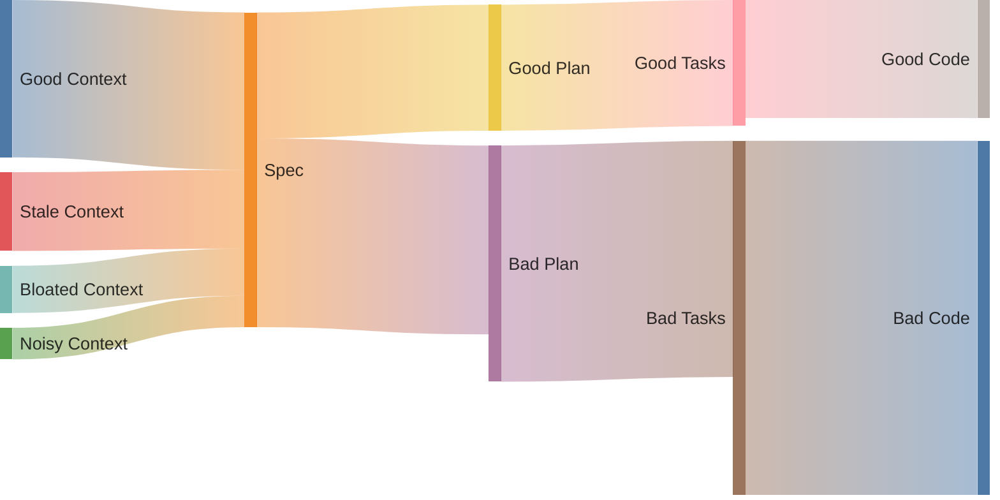
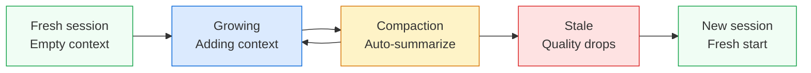

# Context Engineering for AI-Assisted Development

Context engineering is giving the AI the right information at the right time. That's it. Curate what the model sees, get better results.

Why does this matter? Because AI coding assistants don't actually "know" your codebase. They only know what's in front of them right now. Feed them garbage context, get garbage output. Feed them focused, relevant context, and they'll surprise you.

This guide starts with practical patterns you can use today, then explains the underlying problem (context rot) and how to fight it systematically.

---

## Practical techniques

If you're new to context engineering, these are the most impactful things you can do today in VS Code. No configuration files, no custom agents — just habits.

### Use Plan mode before jumping into code

The single best thing you can do for context quality is **plan before you implement**. VS Code has a built-in Plan agent that researches your codebase, asks clarifying questions, and produces a structured implementation plan — all before writing a single line of code.

1. Open Chat (`Ctrl+Alt+I`) and select **Plan** from the agents dropdown, or type `/plan`
2. Describe your task at a high level
3. Answer the clarifying questions
4. Review the plan, iterate, then hand off to implementation

Why this matters for context: the plan becomes a persistent artifact the agent can reference throughout implementation. Instead of relying on scattered conversation history, the agent follows a structured document.

```
/plan Add user authentication with OAuth2 and JWT tokens
```

See the [Plan Mode](/fundamentals/plan-mode) guide for the full workflow, including model configuration, parallel plans, and todo list tracking.

### Let subagents handle research

Subagents are child agents that spin up to handle a subtask in their own isolated context window. The parent agent delegates work, the subagent does it, and only the summary comes back.

This is powerful for context management because:

- **Isolation** — the subagent's research doesn't bloat your main context window
- **Focus** — each subagent works on one thing only
- **Compression** — you get a summary, not a wall of raw findings

You don't need to configure anything. When you use Plan mode or Agent mode, VS Code spawns subagents automatically during the discovery phase. For example, while planning a feature, the agent might launch subagents to read configuration files, analyze existing patterns, and search for related tests — all in parallel.

For custom workflows, you can reference the `runSubagent` tool explicitly in custom agents:

```markdown
# Planning Agent
Run #tool:runSubagent to research the codebase autonomously.
```

### Compaction: when VS Code summarizes for you

As your conversation grows, VS Code tracks how much of the model's context window you've used. You can see this in the **context window control** at the bottom of the chat input — it shows a fill bar and token count (e.g., 15K/128K).

When the context window fills up, VS Code **automatically summarizes** the conversation history to free up space. This is called compaction. It keeps the most recent and relevant information while condensing older exchanges.

:::tip
Hover over the context window indicator to see the exact token breakdown by category (conversation, files, instructions, etc.).
:::

Compaction helps, but it's lossy — the model decides what to keep and what to compress. You can't control what gets summarized away. This is why the other techniques in this guide (files as notebooks, re-reading plans, fresh starts) exist: they give you explicit control over what stays in context.

**When to start a new session instead of relying on compaction:**
- Switching to a completely different task
- The agent keeps referencing outdated decisions
- Quality has visibly dropped despite the conversation being short

### Monitor your context window

Get in the habit of glancing at the context window indicator. It's your fuel gauge.

| Fill level | What to expect |
|------------|----------------|
| < 30% | Plenty of room. Add files freely. |
| 30–70% | Working well. Be intentional about what you attach. |
| 70–80% | Compaction may kick in. Consider a fresh session soon. |
| > 80% | Quality is likely degrading. Start fresh. |

### Attach context deliberately with #-mentions

Instead of hoping the agent finds the right files, tell it exactly what to look at:

- `#file:src/auth/login.ts` — specific file
- `#codebase` — let VS Code search your workspace
- `#fetch https://api-docs.example.com` — pull in web documentation
- `#terminalSelection` — reference terminal output

When precision matters, explicit #-mentions prevent the agent from wasting context on irrelevant files.

### Keep separate sessions for separate tasks

One conversation = one task. Don't reuse a session where you debugged a caching issue to now implement a new UI feature. The old context will pollute the new task.

VS Code makes this easy — create a new session with `Ctrl+N` in the Chat view. Your previous session stays accessible in the sessions list.

---

## Context Rot: The Inevitable Problem

Here's the uncomfortable truth: your context will rot. Not if. When.

Context rot is the performance degradation that happens as your conversation grows. It's not a gradual decline either. Models can maintain 95% accuracy, then suddenly plummet to 60% when you cross some invisible threshold. Sharp drops, not gentle slopes.

[Research across 18 leading LLMs](https://research.trychroma.com/context-rot) (GPT-4.1, Claude 4, Gemini 2.5, Qwen 3) confirms every model is affected. This isn't a bug in one tool. It's how attention mechanisms work.

### Why it happens

LLMs have a "lost in the middle" problem. They're great at remembering the beginning and end of conversations. The middle? Not so much. Accuracy drops 15-20 points purely based on where information appears in the context window.

And here's the annoying part: adding more context to "help" often makes things worse. More tokens means more places for attention to scatter. Chain-of-thought reasoning can actually degrade on long-context tasks.

### What it looks like in practice

You'll know context rot when you see it:

| Scenario | What rots | What you'll see |
|----------|-----------|-----------------|
| Multi-file refactor | Earlier file changes fade | You renamed `UserService` to `AccountService` in file 1. By file 5, the agent calls it `CustomerService`. |
| Long debug session | Original error description | You said the bug is in the cache layer. 40 messages later, it's debugging the database. |
| Spec changes mid-task | Old and new requirements coexist | PM changed the requirements. Agent still builds the old spec while partially acknowledging the new one. |
| Research then implement | Research findings | It found three useful Stack Overflow answers. Forgot all of them when writing code. |
| Multi-day task | Yesterday's decisions | Made an architectural choice Tuesday. Wednesday it makes the opposite choice. |

### Signs you're experiencing it

- Agent asks questions you already answered
- It suggests approaches you explicitly rejected
- Hallucinations creep into otherwise solid responses
- It contradicts its own earlier work
- Responses become vague or generic

### Types of rot

| Type | What happens | Example |
|------|--------------|---------|
| Temporal | Time-sensitive info goes stale | Outdated API docs, changed requirements |
| Structural | Relationships between things shift | Refactored code, moved files |
| Semantic | Meaning changes even if words don't | Renamed concepts, evolved terminology |

### How rot compounds

Bad context doesn't just hurt one step. It cascades through your entire workflow:



A slightly stale spec produces a mediocre plan. A mediocre plan produces scattered tasks. Scattered tasks produce buggy code. Each stage amplifies the previous problem.

---

## Principles to combat context rot

These aren't abstract ideas. Each one directly fights a specific type of rot.

### 1. Use files as your agent's notebook (aka Structured Note Taking Approach)

Context windows have limits. The filesystem doesn't.

Store large content in files, not chat. Keep references in context, not full contents. Let the agent look things up when needed.

```
_plans/
  plan.md          # Current goals and status
  research.md      # Findings and sources
  decisions.md     # Choices and why you made them
```

This fights context bloat. Instead of cramming everything into the conversation, externalize it.

### 2. Re-read your plan so the agent remembers

After many interactions, original goals fade. The "lost in the middle" effect buries them.

Keep a plan file. Have it re-read before major decisions:

```
Start of context: [Original goal - attention has faded]
...many interactions...
End of context: [Recently read plan.md - fresh attention!]
```

Reading the plan moves goals back into the attention window. Simple but effective.

### 3. Keep your failures visible

Error recovery shows whether an agent is actually reasoning or just pattern-matching.

Log failed attempts where the agent can see them:

```markdown
## Errors encountered
- FileNotFoundError: config.json not found → Created default config
- API timeout → Retried with exponential backoff, succeeded
```

The model updates its understanding when it sees what didn't work. This prevents the "try the same failing approach three times" loop.

### 4. Vary your patterns

Uniformity breeds fragility. When you copy-paste the same patterns repeatedly, the model starts overfitting to them. Drift and hallucination follow.

Break the monotony:
- Vary phrasings slightly
- Don't duplicate patterns blindly
- Recalibrate the agent on repetitive tasks

---

## Context Engineering in GitHub Copilot

Copilot has specific mechanisms for managing context. Here's how they map to the principles above.

### Built-in agents and their roles

VS Code provides three built-in agents, each optimized for different context patterns:

| Agent | Purpose | Context behavior |
|-------|---------|------------------|
| **Agent** | Autonomous multi-file coding | Decides what context to gather; spawns subagents |
| **Plan** | Research and planning | Read-only; builds a plan document as persistent context |
| **Ask** | Questions and explanations | Includes active file; no file changes |

Pick the right agent for the task. Using Agent mode to ask a quick question wastes context on tool calls you don't need. Using Ask mode for a multi-file refactor means the agent can't actually help.

For specialized workflows, create [custom agents](/category/agents) with specific tools, models, and instructions.

### Context layers

| Layer | Location | When loaded | Who decides |
|-------|----------|-------------|-------------|
| Project instructions | `.github/copilot-instructions.md` | Always | System |
| Agent memory | `AGENTS.md` | Always | System |
| Scoped instructions | `.github/instructions/*.instructions.md` | When matching files open | System (by pattern) |
| Prompts | `.github/prompts/*.prompt.md` | On demand via `/name` | You |
| Agents | `.github/agents/*.agent.md` | On demand via `#runSubagent` | You/System |
| Skills | `.github/skills/<name>/SKILL.md` | When AI thinks it's relevant | AI |

More context interfaces means more space consumed. Be strategic about what you configure.

See [customizations](/category/customizations/) for detailed setup of each layer.

### Subagents: isolated context for subtasks

Subagents are child agents that operate in their own context window. The parent delegates a task, the subagent completes it, and only the result (not the full research trail) returns to the parent.

This is how Plan mode researches your codebase without bloating the main conversation. Multiple subagents run in parallel — one reads your config, another greps for patterns, a third checks tests — and each reports back a summary.

You get the benefit of broad research with the cost of minimal context consumption in the parent.

### Compaction and context lifecycle

Every conversation has a lifecycle:



Compaction buys you time by summarizing older exchanges. But it's automatic and lossy — you can't choose what survives. Combine compaction with explicit strategies (files as notebooks, plan re-reads) for reliable long sessions.

---

## Planning with files workflow

For complex tasks, use the [Planning with Files](/customizations/skills/planning-with-files) skill to persist context across sessions.

### Rules that actually matter

:::info
1. Store, don't stuff. Large outputs go to files, not context.
2. Log every error. Failed attempts in `plan.md` prevent loops.
3. Record why, not just what. Decisions without rationale are useless later.
4. Update status immediately. Mark complete as you go.
5. Re-read after ~20 interactions. Refresh goals before the agent forgets them.
:::

---

## Caveats

### This isn't really engineering

"Context engineering" sounds precise. It's not.

Once the agent gets your instructions, execution depends on how well the model interprets them. You can increase the probability of good results. You cannot guarantee them.

Don't fall for phrases like "ensure it does X" or "prevent hallucinations." LLMs are probabilistic. Choose the right level of oversight for the task.

### Sharing context configurations

People love sharing their setups. Careful with that.

Problems with borrowed configs:
- The sharer's codebase is different from yours
- There's a tendency to overengineer upfront (build gradually instead)
- Different experience levels need different guidance
- If you don't know what's in your context, you'll blame the agent for following your own instructions

Build your context configuration iteratively. Start minimal. Add rules when you actually hit problems.

---

## Sources

- Böckeler, Birgitta. "[Context Engineering for Coding Agents](https://martinfowler.com/articles/exploring-gen-ai/context-engineering-coding-agents.html)." Martin Fowler, February 2026.
- Chroma Research. "[Context Rot in LLMs](https://research.trychroma.com/context-rot)." 2025.
- VS Code Docs. "[Planning with agents](https://code.visualstudio.com/docs/copilot/agents/planning)." 2026.
- VS Code Docs. "[Set up a context engineering flow](https://code.visualstudio.com/docs/copilot/guides/context-engineering-guide)." 2026.
- VS Code Docs. "[Manage context for AI](https://code.visualstudio.com/docs/copilot/chat/copilot-chat-context)." 2026.
- VS Code Docs. "[Using agents in VS Code](https://code.visualstudio.com/docs/copilot/agents/overview)." 2026.
