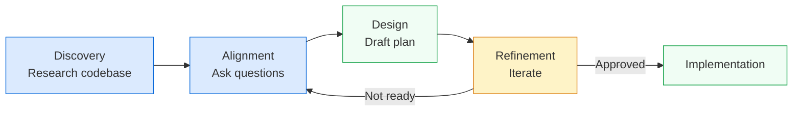

# Plan Mode

Plan mode is a built-in agent in VS Code that researches your codebase and collaborates with you to create a detailed implementation plan before any code changes happen. Think before you code.

---

## Why plan first?

Jumping straight into implementation works for small tasks. For anything complex — a new feature, a large refactoring, a system integration — skipping the plan is how you end up with half-built solutions and wasted iterations.

Plan mode gives you:

- **Codebase research** — sub-agents read files, grep patterns, and understand the architecture so you don't have to explain everything manually
- **Clarifying questions** — the agent asks what it doesn't know instead of guessing wrong
- **Structured plans** — a breakdown of steps, verification criteria, and documented decisions
- **Clean handoff** — once approved, the plan feeds directly into implementation

---

## How it works

The plan agent follows a 4-phase iterative workflow:

**Discovery** → **Alignment** → **Design** → **Refinement**

1. **Discovery** — Sub-agents spin up to read files, grep patterns, and understand the codebase. They report back to the main agent with a picture of what exists.
2. **Alignment** — The agent asks clarifying questions through interactive prompts. These pause execution until you respond, so the plan reflects your actual intent.
3. **Design** — A plan draft appears: high-level summary, step breakdown, verification steps, and decisions made during planning.
4. **Refinement** — You iterate. Adjust scope, clarify requirements, add context. Stay in plan mode until the plan is solid.



---

## Getting started

1. Open the Chat view (`Ctrl+Alt+I`) and select **Plan** from the agents dropdown, or type `/plan` followed by your task description.

2. Describe what you want at a high level:
   ```
   Add a favorites feature — users can favorite items, 
   dedicated favorites page, all local storage, no user accounts
   ```

3. Answer the clarifying questions. The agent will present interactive prompts — select options or type responses directly.

4. Review the plan draft. Iterate if needed — you can refine multiple times before committing.

5. Hand off to implementation:
   - **Implement locally** — switches to agent mode in the same session
   - **Continue in background** — delegates to a background agent session
   - **Continue in cloud** — uses a cloud agent session
   - **Open in editor** — saves as a prompt file for later use or team review

:::tip Partial implementation
When starting implementation, you can scope it: *"Start with the UI only"* or *"Only steps 1 and 2"*.
:::

---

## Running multiple plans

You can spin up multiple plan sessions in parallel. Each session runs independently with its own sub-agents. Start one plan for a feature, open another for a search component — they won't interfere.

---

## Model configuration

You can assign different models to different agent modes. Useful when you prefer a stronger reasoning model for planning and a faster one for implementation.

In VS Code settings, search for `default model`:

| Setting | Purpose |
|---------|---------|
| Default inline chat model | Model for inline code edits |
| Default plan agent model | Model used during plan mode |
| Default implement agent model | Model used during implementation |
| Default sub-agent model | Model for sub-agents during research |

Leave blank to use the same model everywhere.

---

## Interactive questions

Enable interactive questions in settings to get the most out of plan mode. The agent will present multi-select options and focused questions instead of dumping a wall of text.

Settings → search `ask questions` → enable.

This turns planning from a monologue into a conversation. You answer a few targeted questions, and the plan becomes dramatically better aligned with your intent.

---

## Todo list tracking

During implementation, the agent creates a todo list that tracks progress through the plan. Each step gets checked off as it completes.

You can interact with the todo list using natural language:
- *"Revise step 1 to do X instead"*
- *"Add another task for error handling"*
- *"Skip step 3 for now"*

The agent manages updates automatically based on your feedback and what it discovers during implementation.

---

## Extended plan mode

For high-stakes work where correctness is critical, layer a structured four-stage approach on top of plan mode. This adds explicit context priming and evaluation phases.

### The four stages

#### Stage 1: Context Priming

- Provide the AI with proper context about the codebase
- Share requirements and implementation details
- Help it understand existing patterns and architecture

#### Stage 2: Planning

- Use **Plan Mode** to create an implementation plan
- Review the plan thoroughly before proceeding
- Ensure all edge cases and requirements are covered

#### Stage 3: Implementation

- Let the AI follow the plan autonomously
- Monitor progress and inspect changes as they happen
- Provide additional context or course-correct if needed

#### Stage 4: Evaluation

The goal is to **close the feedback loop** — give the AI a way to verify its own work without manual inspection. Tests are one option, but not the only one.

- **Unit/integration tests** — the most reliable signal
- **Build checks** — does the code compile and pass linting?
- **E2E/visual verification** — Playwright, screenshots, or browser preview for frontend
- **Script-based validation** — a custom script that checks expected output, file structure, or API responses
- **Self-review prompt** — ask the AI to review its own diff against the original requirements

:::warning Close the Loop
If there's no automated way to verify the result, the AI can't self-correct. Before starting, ask yourself: *"How will the AI know it's done correctly?"* — and set that up first.
:::

:::tip Supervisory Role
Act as a supervisor during implementation — stay engaged but let the AI work through the plan independently.
:::

---

## References

- [Planning with agents in VS Code](https://code.visualstudio.com/docs/copilot/agents/planning) — Official VS Code documentation on plan agent, todo lists, and the planning workflow.
- [Plan Mode in VS Code — Game-Changing Features](https://www.youtube.com/watch?v=IxZCSOfMob8) — Video walkthrough of plan mode features including interactive questions, model configuration, parallel sessions, and implementation handoff.
