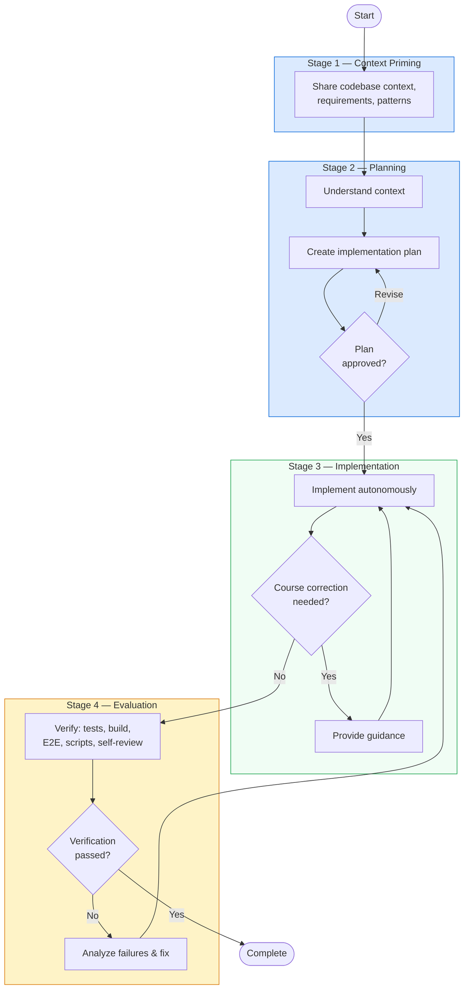

# Extended Plan Mode

A structured four-stage approach for implementing complex features with AI coding assistants. Use this when quality and correctness are critical.

## The Four Stages

### Stage 1: Context Priming

- Provide the AI with proper context about the codebase
- Share requirements and implementation details
- Help it understand existing patterns and architecture

### Stage 2: Planning

- Use **Plan Mode** to create an implementation plan
- Review the plan thoroughly before proceeding
- Ensure all edge cases and requirements are covered

### Stage 3: Implementation

- Let the AI follow the plan autonomously
- Monitor progress and inspect changes as they happen
- Provide additional context or course-correct if needed

### Stage 4: Evaluation

The goal is to **close the feedback loop** — give the AI a way to verify its own work without manual inspection. Tests are one option, but not the only one.

- **Unit/integration tests** — the most reliable signal
- **Build checks** — does the code compile and pass linting?
- **E2E/visual verification** — Playwright, screenshots, or browser preview for frontend
- **Script-based validation** — a custom script that checks expected output, file structure, or API responses
- **Self-review prompt** — ask the AI to review its own diff against the original requirements

:::warning Close the Loop
If there's no automated way to verify the result, the AI can't self-correct. Before starting, ask yourself: *"How will the AI know it's done correctly?"* — and set that up first.
:::

:::tip Supervisory Role
Act as a supervisor during implementation — stay engaged but let the AI work through the plan independently.
:::

## Workflow

## When to Use

| Scenario | Recommended? |
|----------|-------------|
| Complex multi-step features | Yes |
| Production code requiring correctness | Yes |
| Quick bug fixes or one-liners | No — just do it directly |
| Exploratory prototyping | No — iterate freely instead |
